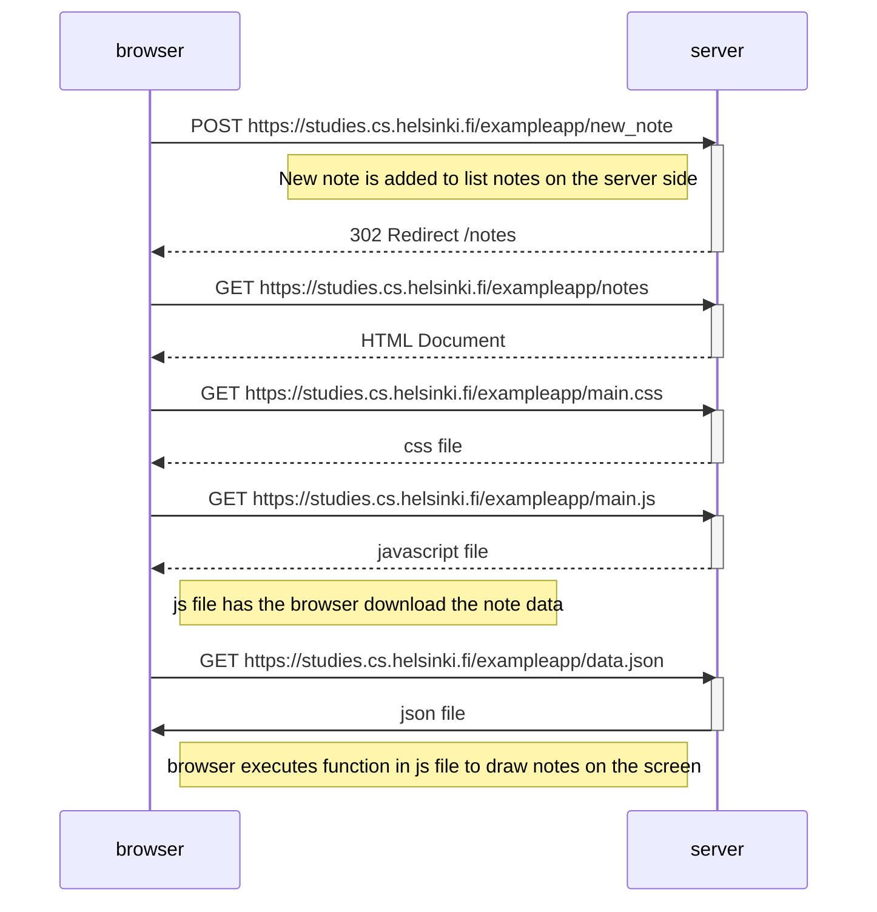
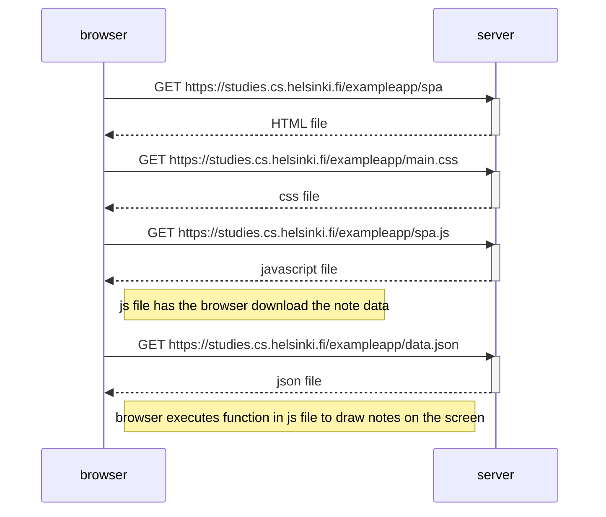
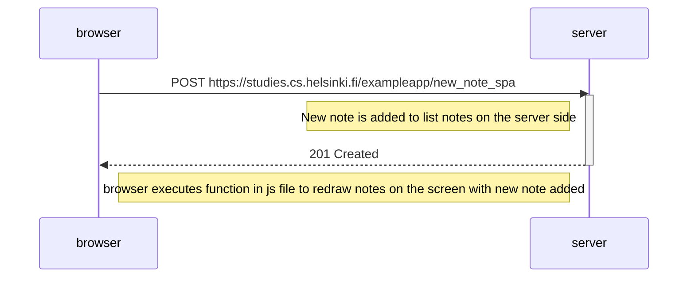

<h1>0.4</h1>
Dialog between server and browser when saving a note on https://studies.cs.helsinki.fi/exampleapp

<h1>0.5</h1>
Dialog between server and browser when opening https://studies.cs.helsinki.fi/exampleapp/spa

<h1>0.6</h1>
Dialog between server and browser when saving a note on https://studies.cs.helsinki.fi/exampleapp/spa
